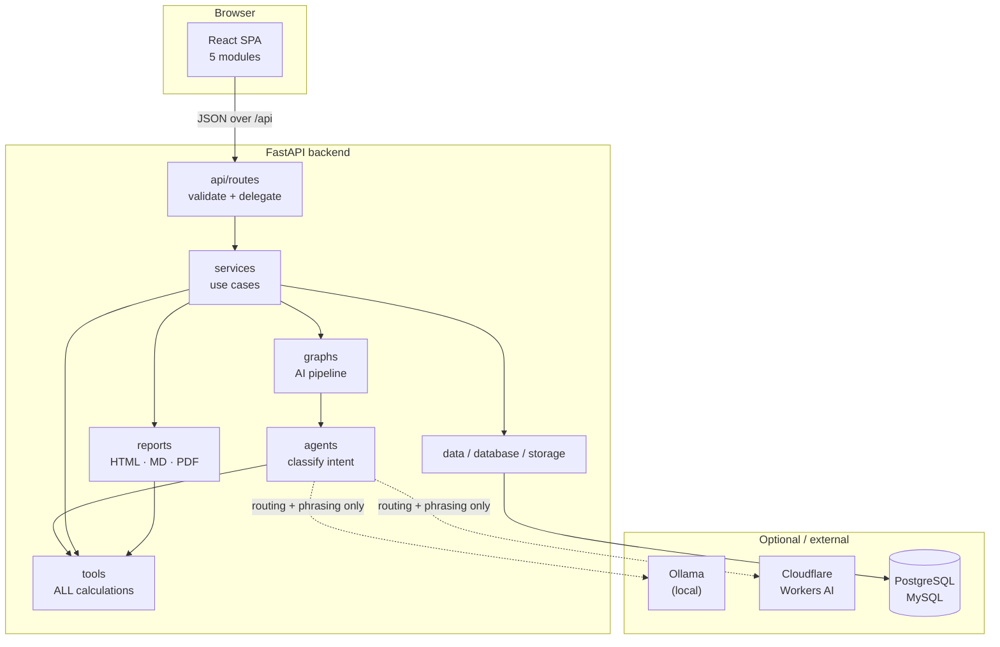
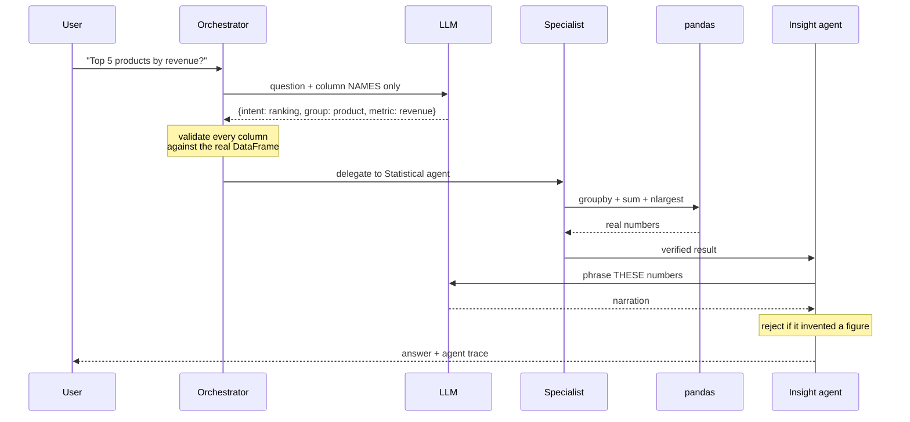

# System Overview

A complete walkthrough of what Datum is, how it is built, and what powers each part.

For narrower topics see [architecture.md](architecture.md) (dependency rules), [agents.md](agents.md) (the AI pipeline), [api.md](api.md) (endpoints), and [database.md](database.md) (SQL sources).

---

## 1. What this is

Datum is a data analysis workspace for a data science team. You load one dataset and it stays active across every module: profile it, run statistical analysis, ask questions in plain English, build charts, engineer features, and export a report.

It runs as a **modular monolith** — one FastAPI backend, one React frontend, no message queues or microservices. That is deliberate: the whole thing starts with two commands and a new developer can read the entire backend in an afternoon.

### At a glance

| | |
|---|---|
| Backend | 3,004 lines across 110 Python files |
| Frontend | 2,067 lines across 46 TypeScript files |
| Tests | 93 tests, 753 lines |
| External services | None required. Ollama and Cloudflare are both optional. |
| Persistence | In-process memory (see [§10](#10-data-lifecycle)) |

---

## 2. Technology choices

### Backend

| Library | Version | Used for | Why this one |
|---|---|---|---|
| **FastAPI** | 0.115.6 | HTTP layer, validation, OpenAPI docs | Type hints become request validation and `/docs` for free |
| **Pydantic** | (via FastAPI) | Request/response schemas | Rejects bad input before it reaches business logic |
| **pandas** | 2.2.3 | Every calculation | The lingua franca of data science; the team already knows it |
| **NumPy** | 2.2.1 | Histograms, linear algebra, array maths | pandas' foundation |
| **SciPy** | 1.15.1 | Hypothesis testing (`ttest_ind`) | Only used in `tools/statistics/hypothesis_test.py` |
| **scikit-learn** | 1.6.1 | Regression, classification, train/test split, metrics | Standard, and gives honest held-out scores rather than fit-on-everything numbers |
| **Plotly** | 5.24.1 | Chart construction, server-side | Produces a JSON figure spec the browser renders interactively — no image rendering, no headless browser |
| **ReportLab** | 4.2.5 | PDF export | Pure Python. WeasyPrint would look better but needs GTK/Pango system libraries on Windows |
| **SQLAlchemy** | 2.0.36 | Database connections | One API for both PostgreSQL and MySQL |
| **psycopg / PyMySQL** | 3.2.3 / 1.1.1 | Database drivers | PostgreSQL and MySQL respectively |
| **openpyxl** | 3.1.5 | `.xlsx` parsing | Never imported directly — pandas uses it under the hood for `read_excel` |
| **uvicorn** | 0.34.0 | ASGI server | The standard FastAPI runner |
| **python-dotenv** | 1.0.1 | Loads `.env` | Keeps all configuration in the environment |
| **pytest / httpx** | 8.3.4 / 0.28.1 | Tests | `httpx` backs FastAPI's `TestClient` |

> **Note:** `jinja2` is listed in `requirements.txt` but is **not imported anywhere**. HTML reports are built directly in `reports/html_generator.py`. The leftover `app/reports/templates/analysis_report.html` is unused. Both are safe to remove.

**No HTTP client library.** Calls to Ollama and Cloudflare use Python's built-in `urllib` — one dependency less for two simple JSON POSTs.

### Frontend

| Library | Used for | Why this one |
|---|---|---|
| **React 19** | UI | Team familiarity |
| **TypeScript** | Types | `strict` mode is on; the API response shapes are typed in `src/types/` |
| **Vite** | Dev server, bundler | Instant HMR; proxies `/api` to the backend so there is no CORS friction in development |
| **Plotly.js** (`react-plotly.js`) | Rendering charts | Consumes the figure spec the backend sends, unchanged |
| **lucide-react** | Icons | Tree-shakeable SVG icons |

**No state library, no router, no CSS framework.** State is a ~40-line store built on React's `useSyncExternalStore`; navigation is a single `useState` across five modules; styles are hand-written CSS. At this size each of those would cost more than it saves.

---

## 3. Architecture



**Dependencies point downward only.** `tools` knows nothing about HTTP, agents, or the LLM — it takes a DataFrame and returns numbers. That is what makes the calculation guarantee in [§8](#8-the-ai-agent-system) enforceable rather than aspirational.

---

## 4. How a request flows

Taking `GET /api/datasets/{id}/eda/quality` as the example:

1. **`api/routes/eda.py`** — FastAPI matches the route. The `ActiveDataset` dependency resolves the dataset id to a `DatasetRecord`, raising `DatasetNotFoundError` (→ 404) if it doesn't exist.
2. **`services/eda_service.py`** — `quality()` orchestrates but does not calculate.
3. **`tools/quality/*`** — `missing_summary`, `duplicate_summary`, `iqr_outliers`, and `datatype_issues` each do one job on the DataFrame.
4. **`utils/dataframe_utils.py`** — `finite()` converts `NaN` and `±inf` to `None`, because those are not valid JSON.
5. **FastAPI** serialises the dict and returns it.

Errors follow one convention: raise `AnalysisError` (→ **422**) or `DatasetNotFoundError` (→ **404**), both mapped once in `app/main.py`. Every handler carries a human-readable `detail` intended for display.

---

## 5. Backend, layer by layer

| Package | Responsibility | Notable contents |
|---|---|---|
| `api/routes/` | HTTP surface, one file per feature | `datasource`, `dataset`, `eda`, `feature_engineering`, `ai_analysis`, `visualization`, `reports` |
| `schemas/` | Pydantic request/response models | `models.py` holds the definitions; the per-feature files re-export |
| `services/` | Use-case coordination | `dataset_service` (the in-memory store), `eda_service`, `ai_service`, `chart_service`, `feature_service`, `report_service` |
| `agents/` | Intent classification and delegation | `orchestrator`, `statistical`, `pattern`, `predictive`, `insight`, plus `fallback.py` (keyword router) |
| `graphs/` | Sequences one AI analysis | `state`, `nodes`, `routing`, `graph` — plain Python, no LangGraph |
| `tools/` | **Every calculation lives here** | `quality/`, `statistics/`, `distribution/`, `correlation/`, `feature_engineering/`, `prediction/`, `visualization/` |
| `llm/` | The provider boundary | `client.py` (Ollama + Cloudflare), `structured_output.py`, `prompts/*.md` |
| `data/` | File and query parsing | `csv_loader`, `excel_loader`, `database_loader`, `loader` |
| `database/` | SQLAlchemy plumbing | `connection`, `models`, `session` |
| `reports/` | Section assembly and rendering | `generator` (shared), then `html_generator`, `markdown_generator`, `pdf_generator` |
| `storage/` | Artifact persistence | `dataset_storage`, `chart_storage`, `report_storage` |
| `utils/` | Shared sanitizers | `dataframe_utils` (`json_records`, `finite`, `finite_series`, `column_kind`) |
| `core/` | Cross-cutting | `exceptions`, `constants`, `logging`, `security` |

---

## 6. Frontend structure

```
src/
├── App.tsx              shell + module switching only
├── app/                 five pages, one per module
├── components/
│   ├── common/          Card, Field, DataTable, Metric, Title, Empty, Loading, Tabs
│   ├── layout/          Sidebar, Header, MainLayout
│   ├── datasource/      FileUpload, DatabaseForm, DatasetPreview
│   ├── eda/             six tab components
│   ├── ai/              AIChat, AgentStatus, AnalysisResult, InsightCard
│   ├── visualization/   ChartBuilder, ChartControls, ChartPreview
│   └── reports/         ReportBuilder, ReportSections, ReportPreview
├── hooks/               useDataset, useEDA, useAIAnalysis
├── services/            one typed API client per feature
├── store/               datasetStore — the active dataset
├── types/               mirrors the backend response shapes
└── utils/               formatters
```

Pages compose components; components call `services/`; `services/` wrap the shared `api()` helper which unwraps FastAPI's `detail` field into a readable `Error`.

The AI conversation lives in `App.tsx` rather than in the AI page, so saved answers survive tab switches and can be fed into the report builder.

---

## 7. The five modules

| Module | Frontend | Backend | Powered by |
|---|---|---|---|
| **Data source** | `app/datasource` | `routes/datasource.py` → `dataset_service` | pandas `read_csv`/`read_excel`, SQLAlchemy for SQL |
| **Exploratory analysis** | `app/exploratory-analysis` (6 tabs) | `routes/eda.py` → `eda_service` → `tools/` | pandas + NumPy; Plotly.js renders in-browser |
| **AI analysis** | `app/ai-analysis` | `routes/ai_analysis.py` → `ai_service` → `graphs` → `agents` | pandas for figures; Ollama/Cloudflare for routing and phrasing |
| **Visualization** | `app/visualization` | `routes/visualization.py` → `chart_service` → `tools/visualization` | Plotly server-side spec → Plotly.js client-side render |
| **Reports** | `app/reports` | `routes/reports.py` → `report_service` → `reports/` | Shared section assembly, then three renderers |

---

## 8. The AI agent system

This is the most interesting part of the codebase.

### The guarantee

> **The language model routes and explains. pandas computes. Every figure a user sees originates from a deterministic tool.**

### The pipeline



### The five agents

| Agent | Handles |
|---|---|
| **Orchestrator** | Reads the question, produces a routing plan, delegates |
| **Statistical** | Aggregations, rankings, descriptive stats, IQR outliers |
| **Pattern** | Correlation, relationships, trends, segmentation |
| **Predictive** | Regression, classification, forecasting |
| **Insight** | Dataset overviews, and explaining verified results |

### Three enforcement points

The guarantee is not just a prompt instruction — it is checked in code:

1. **Column validation** (`orchestrator_agent.py`) — every column the model names is checked against the real DataFrame. Invented ones are discarded. A plan naming nothing usable defers to the keyword router.
2. **Computation isolation** (`agents/*.py`) — specialists can only reach numbers through `app.tools`, which take a DataFrame.
3. **Narration grounding** (`insight_agent._is_grounded`) — every number in the model's sentence is compared against the verified result, tolerating rounding within 1%. A sentence containing an invented figure is thrown away and the deterministic sentence stands.

`AgentResult.verified` is `True` only on that path. `narration_source` records whether the wording came from the model (`"llm"`) or a template (`"template"`).

### Degraded mode

**The platform works with no language model at all.** When the provider is unreachable:

- `OrchestratorAgent.plan` falls back to `agents/fallback.py`, a deterministic keyword router
- `InsightAgent.narrate` returns the template sentence unchanged
- A 30-second circuit breaker means each request pays at most one failed connection
- `GET /api/ai/health` reports `mode: "deterministic"` so the UI says so plainly

Answers are still fully computed and still marked `verified`. This is covered by `test_falls_back_when_llm_unreachable` — the single most important test in the suite.

### LLM providers

Selected by `LLM_PROVIDER` in `.env`. One is active at a time.

| Provider | Value | Role | Configuration |
|---|---|---|---|
| **Ollama** | `ollama` (default) | The official service — runs locally, data never leaves the machine | `OLLAMA_BASE_URL`, `OLLAMA_MODEL`, … |
| **Cloudflare Workers AI** | `cloudflare` | For testing, when running a local model isn't practical | `CLOUDFLARE_ACCOUNT_ID`, `CLOUDFLARE_API_TOKEN`, `CLOUDFLARE_MODEL` |

There is **no automatic failover** between them. A provider is chosen deliberately; silently answering from a different one would make test results misleading.

Only **column names and types** are ever sent to a provider — never row values.

---

## 9. Design decisions worth knowing

| Decision | Reasoning | Cost |
|---|---|---|
| Server-side Plotly spec, client-side render | Charts stay interactive with no image rendering or headless browser | Figure JSON can be large for big datasets |
| ReportLab over WeasyPrint | Installs with plain `pip` on Windows | More code; the correlation matrix is drawn as a shaded table rather than an image |
| Plain-Python graph, not LangGraph | The flow is linear; a framework would add a dependency for no gain | Would need replacing for branching or looping agents |
| Restricted AST for formulas | A calculated column cannot reach imports, attributes, or builtins — `eval` is never used | Only `+ - * / ** %` and column names are supported |
| In-memory dataset store | Zero setup; the whole app runs with two commands | Restart clears data; single process only |
| No frontend state library | ~40 lines of `useSyncExternalStore` covers one shared dataset | Would need revisiting with more shared state |
| `urllib` over `requests`/`httpx` for LLM calls | Two simple JSON POSTs don't justify a dependency | More verbose error handling |

---

## 10. Data lifecycle

1. A file upload or SQL query is parsed into a DataFrame.
2. `normalize_frame` strips column-name whitespace and converts date-like text columns to datetimes.
3. The DataFrame is stored in `DatasetStore` — a thread-safe dict keyed by UUID, **in process memory**.
4. Every module reads that same DataFrame. Feature engineering **mutates it in place**, so new columns appear everywhere immediately.
5. On restart, everything is gone.

Database credentials are used for the one request and never stored. Only `SELECT` statements are accepted.

---

## 11. Testing

93 tests via `pytest`. Run with `cd backend && python -m pytest tests -q`.

| File | Covers |
|---|---|
| `test_agents.py` | Routing, LLM fallback, hallucinated columns, narration grounding, figures matching pandas |
| `test_eda.py` | All five EDA endpoints, JSON safety with `NaN`/`inf` |
| `test_prediction.py` | Regression/classification metrics, guardrails, trend forecasting |
| `test_reports.py` | All three formats, PDF byte signature, section ordering |
| `test_structured_output.py` | JSON extraction from messy model output, retry behaviour |
| `test_llm_config.py` | Both providers, missing credentials, circuit breaker, token never leaked |
| `test_platform.py` | End-to-end through `TestClient` |

The frontend has no test suite — `npm run build` type-checks in `strict` mode, which is the current safety net.

---

## 12. Where to find things

| To change… | Look in |
|---|---|
| A calculation | `backend/app/tools/<domain>/` |
| An API endpoint | `backend/app/api/routes/` |
| How an agent decides | `backend/app/agents/orchestrator_agent.py` + `fallback.py` |
| What the LLM is told | `backend/app/llm/prompts/*.md` |
| LLM provider behaviour | `backend/app/llm/client.py` |
| Report content | `backend/app/reports/generator.py` (shared for all formats) |
| A UI screen | `frontend/src/app/<module>/` |
| Styling | `frontend/src/styles.css` |
| Configuration | `backend/app/config.py` + `.env` |

---

## 13. Known gaps

Honest list of what is not there:

- **No authentication.** Anyone reaching the API can read every loaded dataset.
- **No persistence.** Restart loses all data.
- **Single process.** The in-memory store is not shared across workers, so `uvicorn --workers 2` would break it.
- **No row limits.** A very large SQL result could exhaust memory.
- **`jinja2` unused** and the leftover template file — both removable.
- **Cloudflare untested against a live account.** The code path is covered by tests with mocked responses, but the first real call is unproven.
- **No frontend tests** beyond type-checking.

See the production roadmap in the [README](../README.md) for what to add first.
